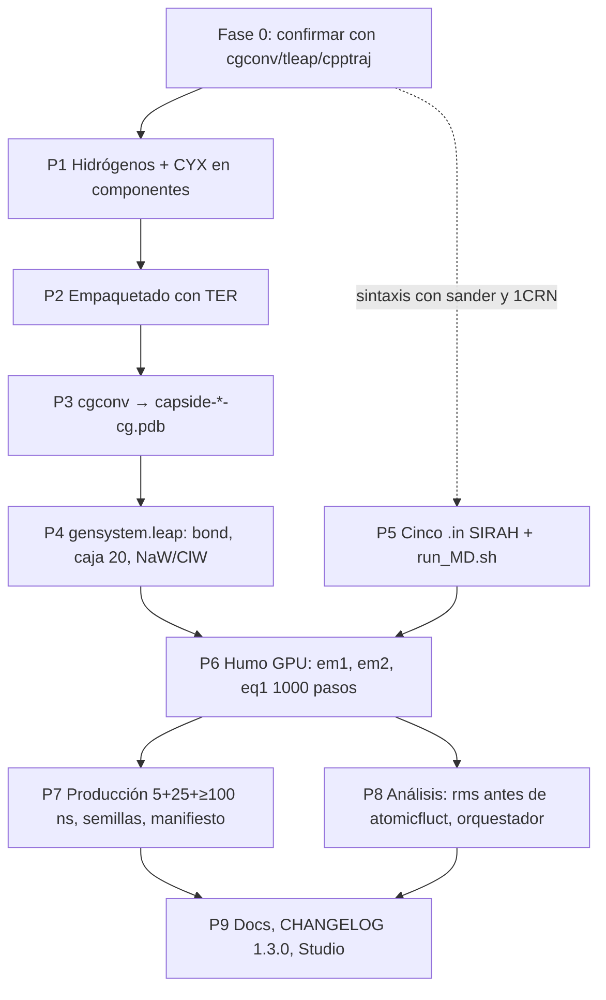

# Plan de reparación — motor PackMan v1.2 (MD coarse-grained SIRAH)

> Entrada: `AUDITORIA_MD.md` (rama `claude/audit-packman-dynamics-engine-52svym`, 2026-10-04).
> Este documento **no re-audita ni cambia código**: convierte el diagnóstico en una secuencia
> de pasos ejecutables, con dependencias, archivos a tocar, contenido exacto, esfuerzo,
> qué se verifica sin GPU y qué exige AMBER, y un checklist de aceptación por paso.
> Patrón de parámetros: los `.in` oficiales de SIRAH en
> `PackMan.v.1.2/archivos_dm_cg/sirah_x2.3_24-07.amber/tutorial/5/` (proteína en WT4) y,
> donde aporta algo, `tutorial/7/` (`skinnb`, etapa `heat`).
>
> Mediciones hechas aquí (Python/NumPy, sin AMBER) que el plan usa y que la auditoría no
> cuantificaba: (a) en el PDB empaquetado los **180 saltos de numeración de residuo
> coinciden exactamente con los 180 cortes C–N > 2,5 Å** (0 discrepancias), así que la
> regla "insertar `TER` donde la numeración retrocede" reconstruye las 181 moléculas sin
> ambigüedad; (b) la enzima tiene **2 puentes disulfuro**: Cys4–Cys16 y Cys18–Cys23
> (SG–SG = 2,04 Å); las otras 3 Cys (126, 248, 342) quedan libres; (c) `capside.pdb` ya
> viene ordenado en bloques `A×60, B×60, C×60` (149/164/164 residuos por subunidad), PyMOL
> solo le quita los `TER` internos, no reordena.

---

## 0. Resumen ejecutivo

| Fase | Pasos | Qué arregla (hallazgos de la auditoría) | GPU |
|---|---|---|---|
| **0. Confirmar en local** | C1–C6 | Nada todavía: confirma MD-02, MD-03, MD-05, MD-09, MD-12, MD-13 con `cgconv`/`tleap`/`cpptraj` antes de tocar nada | No |
| **1. Preparación del sistema** | P1 hidrógenos + CYX · P2 empaquetado con `TER` · P3 cgconv · P4 tLeaP (disulfuros, caja, sal) | MD-02, MD-03, MD-07, MD-12, MD-13, MD-17 | No |
| **2. Protocolo `.in`** | P5 cinco etapas SIRAH + `run_MD.sh` + generador coherente | MD-01, MD-04, MD-05, MD-06, MD-09, MD-10, MD-11, MD-14, MD-20 | No (sintaxis) |
| **3. Humo en GPU** | P6 em1 → em2 → eq1 (1 000 pasos) | Valida P1–P5 juntos; mide ns/día | **Sí** |
| **4. Producción** | P7 5 ns + 25 ns + ≥100 ns con semillas fijas y manifiesto | MD-08, MD-18, MD-19 | **Sí** |
| **5. Análisis** | P8 RMSF alineado, SASA, orquestador | MD-15, MD-16 | No (con la trayectoria de P6) |
| **6. Documentación/Studio** | P9 | MD-08 (cifras sintéticas), CIENCIA-3 | No |

**Camino crítico:** C1–C4 → P1 → P2 → P3 → P4 → P6 → P7. P5 y P8 se escriben en paralelo
pero solo se pueden *validar* contra un `prmtop` válido (P4) y una trayectoria (P6).

**Esfuerzo total estimado:** 20–30 h de trabajo humano + 1–3 días de GPU (V100) para
130 ns. Sin GPU se completa todo salvo P6 y P7.

---

## 1. Por qué este orden

1. **La topología va antes que el protocolo.** Cualquier `.in`, por perfecto que sea,
   corre sobre el `prmtop` que produce tLeaP. Hoy ese `prmtop` tendría 181 moléculas
   encadenadas (MD-03) y 3 866 beads que no provienen de la estructura (MD-02). Arreglar
   primero los `.in` daría una falsa sensación de avance: la primera corrida seguiría
   explotando. Por eso la Fase 1 precede a la Fase 2 en el camino crítico, aunque la
   Fase 2 se pueda *redactar* en paralelo.
2. **Hidrógenos antes que `TER`, y ambos antes que cgconv.** Los hidrógenos se añaden
   sobre los *componentes* (enzima y subunidades), no sobre el PDB empaquetado, porque
   `pdb2pqr` indexa por (cadena, número) y el empaquetado tiene 60 copias de "A 41"
   (MD-13). Los `TER` se insertan *después* de Packmol, porque Packmol los borra. cgconv
   necesita las dos cosas: hidrógenos para mapear `BPG`/`BPE`, y `TER` para propagarlos
   (`cgconv.pl:227-236`).
3. **Disulfuros en tLeaP, no antes.** SIRAH exige `CYX` en el PDB de entrada (lo hace
   `pdb2pqr --ff=AMBER` automáticamente al detectar SG–SG < 2,5 Å) y el `bond` explícito
   en LEaP. Los índices de residuo del `bond` dependen del orden final del PDB empaquetado,
   así que se fijan en P4, una vez estable P2.
4. **Humo antes que producción.** 1 000 pasos de `eq1` bastan para detectar `NaN`,
   `vlimit`, máscaras vacías y para medir el rendimiento real; evita gastar días de GPU
   en un sistema inválido.
5. **Análisis y Studio al final.** No cambian el resultado físico; necesitan una
   trayectoria para probarse.

### 1.1 Grafo de dependencias



---

## 2. Fase 0 — Qué confirmar en local ANTES de empezar (sin GPU)

La auditoría se hizo sin AmberTools. Estas afirmaciones son inferencias razonables pero
**hay que verlas con los ojos** antes de invertir en la reparación, porque el diseño de
P1 y P4 depende de ellas. Requieren: `perl`, AmberTools (`tleap`, `cpptraj`, `pdb4amber`,
`sander`), `pdb2pqr` ≥ 3 (idealmente con `propka`). Tiempo: **2–4 h** (tLeaP sobre
~400 k partículas puede tardar 10–60 min y varios GB de RAM).

| # | Afirmación del diagnóstico a confirmar | Comando | Resultado esperado si la auditoría acierta | Si NO se confirma… |
|---|---|---|---|---|
| **C1** | MD-02: cgconv sin hidrógenos no genera ningún `BPG`/`BPE`. *Qué hace exactamente cgconv* (¿omite el bead en silencio, avisa o aborta?) es `[REQUIERE CORRER]`. | `cd PackMan.v.1.2/archivos_dm_cg/empaquetador && perl ../sirah_x2.3_24-07.amber/tools/CGCONV/cgconv.pl -i capside_1enzimas_20260324_212620.pdb -o sinH-cg.pdb 2>&1 \| tee cgconv_sinH.log; grep -c ' BPG ' sinH-cg.pdb; grep -c ' BPE ' sinH-cg.pdb` | `0` y `0`; el log dirá si avisa | Si cgconv genera `BPG` de alguna forma, P1 pasa de "crítico" a "recomendado" (igual hay que protonar: SIRAH lo exige) |
| **C2** | MD-02 (efecto): tLeaP "inventa" los beads faltantes con geometría de plantilla, en vez de fallar. | `cd .. && sed "s#AUTO_DETECT_CAPSID#empaquetador/sinH-cg.pdb#; s#AUTO_DETECT_OUTPUT#test_sinH#" gensystem.leap > t0.leap && tleap -f t0.leap > tleap_sinH.out; grep -c "Added missing heavy atom" leap.log` | miles de líneas `Added missing heavy atom` (≈ 3 866) o un error fatal; cualquiera de los dos invalida la topología | Si tLeaP falla, la prueba C3 se hace con el CG correcto de P3 |
| **C3** | MD-03: sin `TER`, tLeaP encadena las 181 moléculas en una. | `cpptraj -p test_sinH.prmtop <<< "parminfo"` → leer "molecules"; y `cpptraj -p test_sinH.prmtop <<< $'printBonds :28620,28621'` | 1 molécula de soluto (más WT4/iones); un enlace `GC`/`GO`–`GN` entre el residuo 28620 (última Lys de cápside) y 28621 (Met1 de la enzima) con longitud de decenas de Å | Si tLeaP corta por distancia (no lo hace por defecto), P2 sigue siendo necesario por los termini `nX`/`cX` |
| **C4** | MD-05 y MD-09: `@CA,C,N,O` selecciona 0 beads; `:*&!@H=` selecciona todo. | `cpptraj -p test_sinH.prmtop <<< $'mask @CA,C,N,O\nmask @GN,GO\nmask :*&!@H=\nmask :WT4\nmask :NaW'` | `0` · `58234` (2 × 29 117) · todo el sistema · nº de WT4 · nº de NaW | — |
| **C5** | MD-13: `pdb2pqr --ff=AMBER` no sobrevive a 60 copias de "A 41". Decide el diseño de P1 (por componentes vs. sobre el empaquetado). | `pdb2pqr --ff=AMBER --ffout=AMBER --keep-chain capside_1enzimas_20260324_212620.pdb t.pqr 2>&1 \| tail -20; grep -c "^ATOM" t.pqr` | error, o un PQR con residuos fusionados/perdidos (≠ 29 117 residuos) | Si pasa limpio, P1 puede hacerse sobre el empaquetado (más simple), pero sigue haciendo falta `TER` (P2) |
| **C6** | MD-12: carga neta ≈ −4 (asume His neutras y estados estándar). Cambia tras protonar con `propka` (His) y con `CYX`. | `grep -A1 "Total unperturbed charge" leap.log` tras C2, y de nuevo tras P4 | ≈ −4 ahora; el valor real sale en P4 | Ajustar NaW/ClW de P4 con el valor real |
| **C7** (opcional) | MD-15: `surf` (LCPO) no tiene parámetros para beads SIRAH. | `cpptraj -p test_sinH.prmtop -y test_sinH.ncrst <<< $'surf :1-100 out s.dat'` | warning de parámetros LCPO ausentes o valores sin sentido | Si funciona, P8 conserva `surf` con advertencia |

**Ya confirmado estáticamente aquí, no hace falta correr:** conteo de `TER`
(180 / 3 / 0 / 1 en `capside.pdb` / `capside_recentrada.pdb` / empaquetado / `enzima.pdb`),
29 117 residuos en el empaquetado, 0 hidrógenos, 180 cortes C–N = 180 saltos de numeración,
2 disulfuros en la enzima (MD-07), 0 `SSBOND`, 88 altlocs, `capside.pdb` ya ordenado en
bloques A/B/C.

**No confirmable sin Lucio:** que la explosión a 17 666 K de `heat1` (Studio) salió de esta
ruta. No bloquea el plan; se anota en P9.

---

## 3. Fase 1 — Preparación del sistema (sin GPU)

### P1 — Hidrógenos, `CYX` y estados de His sobre los componentes

**Por qué:** SIRAH mapea `BPG` (SER/THR/CYS) y `BPE` (TRP) desde `HG`/`HG1`/`HE1`
(`sirah_prot.map:87,238,248,261`); `cgconv.pl:358-359` exige entrada protonada; el
tutorial oficial parte de un PQR hecho con `pdb2pqr --ff=amber --ffout=amber --with-ph=7.0`
(cabecera de `tutorial/5/1CRN.pqr:4`). Se hace **por componente** para esquivar MD-13.

**Dependencias:** C1, C5. **Esfuerzo:** 2–4 h. **GPU:** no.

**Archivos:**

- **Nuevo** `PackMan.v.1.2/archivos_dm_cg/empaquetador/0protonar.sh` (o `.py`). Debe:
  1. Partir `capside.pdb` en sus 180 subunidades usando los `TER` existentes
     (`csplit`/Python; cada trozo ≤ 164 residuos, numeración única dentro del trozo).
  2. Para cada trozo y para `enzima.pdb`:
     ```bash
     pdb2pqr --ff=AMBER --ffout=AMBER --keep-chain \
             --titration-state-method=propka --with-ph=7.0 \
             --pdb-output ${f%.pdb}_H.pdb  $f  ${f%.pdb}_H.pqr
     ```
     (si no hay `propka`, quitar `--titration-state-method/--with-ph`; registrar la
     elección). `pdb2pqr --ff=AMBER` renombra automáticamente a `CYX` las Cys con
     SG–SG < 2,5 Å y asigna `HID/HIE/HIP`; SIRAH mapea las tres (`sirah_prot.map:143,154,165`).
  3. Concatenar los 180 trozos protonados con `TER` entre ellos → `capside_H.pdb`
     (180 `TER`); la enzima → `enzima_H.pdb` (1 `TER`).
  4. Altlocs: `pdb2pqr` ya se queda con una posición; si falla por altlocs,
     pasar antes `pdb4amber -i enzima.pdb -o enzima_clean.pdb` (conserva `A`).
- **Ruta alternativa** si `pdb2pqr` no está: `reduce -BUILD -NOFLIP` (AmberTools) sobre
  cada componente + `pdb4amber` para `CYX`. Produce los mismos nombres PDB v3 (`HG`,
  `HG1`, `HE1`). **No usar `h_add` de PyMOL**: nombra los hidrógenos `H01, H02…` y cgconv
  no los reconoce.

**Checklist P1**

- [ ] `grep -c '^TER' capside_H.pdb` = **180**; `enzima_H.pdb` = **1**.
- [ ] Residuos conservados: 28 620 en `capside_H.pdb`, 497 en `enzima_H.pdb` (contar
      cambios de (cadena, resnum) consecutivos, no `grep -c CA`).
- [ ] Hidrógenos presentes: `awk '$1=="ATOM" && substr($0,13,4) ~ /^ *H/' capside_H.pdb | wc -l` > 0;
      en concreto `grep -c " HG  SER" capside_H.pdb` = **1 980**, `grep -c " HG1 THR"` = **1 260**,
      `grep -c " HE1 TRP"` = **360**; en la enzima `HG SER` = 36, `HG1 THR` = 31, `HE1 TRP` = 12.
- [ ] `grep -c "CYX" enzima_H.pdb` cubre los residuos **4, 16, 18, 23** (4 residuos);
      `CYS` queda en 126, 248, 342. En la cápside no hay disulfuros (180 `CYS`, 0 `CYX`)
      salvo que `pdb2pqr` detecte alguno: anotarlo.
- [ ] Ningún residuo renombrado inesperadamente (`ASH`, `GLH`, `LYN`): `grep -c -E "ASH|GLH|LYN"`
      = 0 o justificado por propka.
- [ ] Log de `pdb2pqr` sin "missing heavy atoms" para la cápside (si los hay, es un hueco
      de la estructura 3J7L y hay que decidir: dejarlo o modelarlo).

### P2 — Empaquetado que conserva hidrógenos e inserta `TER`

**Por qué:** `recentrar()` (PyMOL) colapsa 180 `TER` en 3 y Packmol escribe 0
(`packmol_tmp.inp` sin `add_amber_ter`, que de todos modos pondría solo 1 por estructura).
tLeaP corta cadenas únicamente en `TER` (MD-03). Medido aquí: los 180 saltos de numeración
coinciden con los 180 cortes C–N, así que la regla de inserción es determinista.

**Dependencias:** P1. **Esfuerzo:** 3–5 h. **GPU:** no.

**Archivos:**

- `PackMan.v.1.2/archivos_dm_cg/empaquetador/2Empaquetador_Manual.py`
  - `:9-10` → `capsid_input = "capside_H.pdb"`, `enzyme_input = "enzima_H.pdb"`.
  - `:14` → leer `radio_interno.txt` en vez de `radio_interno = 90` (MD-17):
    `radio_interno = float(open("radio_interno.txt").read())`.
  - `:23-31` `recentrar()`: sustituir PyMOL por una traslación en Python puro que reescriba
    solo las columnas 31–54 y **conserve todas las demás líneas** (`TER`, `END`); o, si se
    mantiene PyMOL, aceptar que pierde `TER` porque el paso siguiente los repone.
  - Tras `correr_packmol()` (`:105`), llamar al nuevo `3insertar_TER.py` sobre `output_pdb`.
- `2Empaquetador_Maximo.py:38-46` (misma `recentrar`) y la misma llamada post-Packmol.
- **Nuevo** `PackMan.v.1.2/archivos_dm_cg/empaquetador/3insertar_TER.py`: recorre los
  `ATOM` y escribe `TER` cuando (a) el número de residuo no crece respecto al anterior **o**
  (b) la distancia C(i)–N(i+1) > 2,5 Å; `TER` final antes de `END`. Imprime cuántos insertó.
  Alternativa a confirmar: `pdb4amber -i empaquetado.pdb -o empaquetado_ter.pdb` (inserta
  `TER` en huecos C–N y renumera; comprobar que no rompe la numeración que luego se
  necesita en P4).
- `packmol_tmp.inp` se regenera; no se toca a mano.

**Checklist P2**

- [ ] `grep -c '^ATOM' capside_Nenzimas_*.pdb` = átomos de `capside_H.pdb` + N × átomos de
      `enzima_H.pdb` (con hidrógenos, ya no 220 753).
- [ ] `grep -c '^TER'` = **180 + N** (181 para N = 1).
- [ ] Saltos de numeración = cortes C–N = `TER` insertados (el script lo imprime; 0
      discrepancias).
- [ ] Log de Packmol: "Success" / 0 violaciones, como en
      `log_packmol_1enzimas_20260324_212620.txt`; distancia mínima enzima–cápside ≥ 2 Å
      (tolerancia) y COM dentro de `radio_usado`.
- [ ] Residuos totales = 28 620 + 497 N.
- [ ] El orden es cápside (bloques A×60, B×60, C×60) y luego enzima(s): lo asume P4.

### P3 — Conversión a CG con cgconv sobre el PDB correcto

**Por qué:** `run_maestro.sh:58-63` alimenta cgconv con el PDB sin H ni `TER`;
`convert_to_cg.sh:27` corre `pdb2pqr` sobre el empaquetado completo (MD-13). Con P1+P2
ninguna de las dos hace falta: cgconv recibe directamente el PDB protonado con `TER`.

**Dependencias:** P2. **Esfuerzo:** 1–2 h. **GPU:** no.

**Archivos:**

- `PackMan.v.1.2/run_maestro.sh`
  - `:33-43`: antes de `1calcula_radio_interno.py` ejecutar `0protonar.sh` (una sola vez;
    es idempotente si ya existen `*_H.pdb`).
  - `:58-62`: dejar `cgconv.pl -i "$INPUT_FILE" -o "capside-${DIR}-cg.pdb"` pero
    `INPUT_FILE` es ya el PDB con H y `TER` de P2. Quitar el comentario "salta pdb2pqr".
  - `:75`: `ejecutar_analisis_cpptraj.sh` → `ejecutar_analisis_individual.sh` (P8, MD-16).
- `PackMan.v.1.2/convert_to_cg.sh:25-32`: eliminar el paso `pdb2pqr` sobre el empaquetado
  (o dejarlo como ruta "legacy" con advertencia). Documentar que la protonación vive en P1.
- Retirar o marcar como obsoletos `setup_1_1o.sh` y `setup_universal_md.sh` (usan
  `gensystem_template.leap` y `run_MD_template.sh`, que no existen; MD-16).

**Checklist P3** (todos con `grep` sobre `capside-<dir>-cg.pdb`)

- [ ] Residuos: 29 117 (N = 1).
- [ ] `grep -c ' BPG '` = **3 490** = SER 2 016 + THR 1 291 + CYS libres 183 (187 − 4 que
      son `CYX`→`sX`, sin `BPG`). *La auditoría decía 3 494 porque no descontaba los 4 CYX.*
- [ ] `grep -c ' BPE '` = **372** (TRP).
- [ ] `grep -c ' sX '` ≥ 4 (los 4 `CYX` de la enzima; `grep -c ' BSG '` = 187).
- [ ] `grep -c '^TER'` ≥ **181**.
- [ ] cgconv no imprime avisos de átomos sin mapear ni residuos desconocidos (revisar
      `stderr`); 0 `HETATM`.
- [ ] Comparador: el CG de la misma cápside en `sustratinaitor/1_capside/3J7L_cg.pdb` tiene
      180 `TER` y 3 420 `BPG` (= 1 980 + 1 260 + 180); la parte de cápside del nuevo CG debe
      dar exactamente esos números.

### P4 — `gensystem.leap`: disulfuros, caja 20 Å, 0,15 M NaCl

**Por qué:** sin `bond` las Cys quedan como `sX` sin enlace (MD-07); caja 12 Å vs 20 Å del
tutorial y de `sustratinaitor/4_ensamblaje_y_simulacion/gensystem.leap:16` (MD-12);
`addIonsRand protein NaW 0` solo neutraliza, el comentario promete 0,15 M NaCl (MD-12).

**Dependencias:** P3 (orden de residuos), C6 (carga). **Esfuerzo:** 2–3 h + tiempo de tLeaP
(10–60 min por pasada, dos pasadas). **GPU:** no.

**Archivos:**

- `PackMan.v.1.2/archivos_dm_cg/gensystem.leap` → contenido objetivo:

  ```
  # SIRAH 2.3 (x2.3_24-07) — sistema cápside + N enzimas en WT4
  addPath ./sirah_x2.3_24-07.amber
  source leaprc.sirah

  protein = loadpdb AUTO_DETECT_CAPSID

  # Disulfuros de la enzima (GCasa): Cys4-Cys16 y Cys18-Cys23.
  # tLeaP renumera desde 1 en orden de carga: residuo_tleap = 28620 + 497*(k-1) + i
  # para la enzima k (k=1..N) y su residuo i. Para N=1:
  bond protein.28624.BSG protein.28636.BSG
  bond protein.28638.BSG protein.28643.BSG

  charge protein

  # Caja octaédrica, 20 Å de colchón (tutorial SIRAH y sustratinaitor), closeness 0.7
  solvateOct protein WT4BOX 20 0.7

  # 0.15 M NaCl: cada WT4 ~ 11 aguas -> pares = round(0.15 * N_WT4 * 11 / 55.5) = 0.0297 * N_WT4
  # N_WT4 sale de la 1a pasada (ver setup_universal.sh). Con carga neta q:
  #   NaW = pares + max(0,-q)   ClW = pares + max(0, q)
  addIonsRand protein NaW AUTO_NAW ClW AUTO_CLW

  saveAmberParmNetcdf protein AUTO_DETECT_OUTPUT.prmtop AUTO_DETECT_OUTPUT.ncrst
  savepdb protein AUTO_DETECT_OUTPUT.pdb
  quit
  ```
  `set default PBradii mbondi3` (`:7`) sobra en solvente explícito; se puede quitar.

- `PackMan.v.1.2/archivos_dm_cg/setup_universal.sh:21-33`: convertir en **dos pasadas**:
  1. Pasada 1 con `addIonsRand protein NaW 0` y `savepdb` → contar WT4
     (`grep -c " WT4 " salida.pdb` dividido entre 4 beads por molécula, o
     `cpptraj -p x.prmtop <<< "mask :WT4"` / 4) y leer `charge protein` en `leap.log`.
  2. Calcular `AUTO_NAW`/`AUTO_CLW` con la fórmula de arriba, sustituir con `sed` y
     correr la pasada definitiva.
  También: calcular `AUTO_NRES` = residuos de soluto (29 117 para N = 1) y exportarlo para
  la máscara de `eq1` (P5).

**Checklist P4** (sin GPU; `cpptraj` sobre el `prmtop` final)

- [ ] `leap.log`: **0** líneas `Added missing heavy atom`, **0** `Created a new atom`,
      0 `Warning: Close contact`. Si aparecen, volver a P1/P3.
- [ ] `charge protein` registrado (valor q) y carga total del sistema = 0 tras iones.
- [ ] `cpptraj -p X.prmtop <<< "parminfo"`: moléculas de soluto = **181** (N = 1); el resto
      WT4 + iones.
- [ ] `cpptraj -p X.prmtop <<< $'printBonds @BSG'`: exactamente **2** enlaces BSG–BSG
      (28624–28636 y 28638–28643), longitud ≈ 2 Å.
- [ ] `cpptraj -p X.prmtop <<< $'mask @GN,GO\nmask :1-29117\nmask @CA,C,N,O\nmask :WT4\nmask :NaW\nmask :ClW'`
      → **58 234** · todos los beads de soluto · **0** · N_WT4×4 · NaW · ClW
      (NaW − ClW = −q).
- [ ] Termini: `grep -c -E " (n|c)[A-Z][a-z]? " X.pdb` ≈ **362** residuos terminales
      (181 cadenas × 2), no 2.
- [ ] Caja: `head -1 X.ncrst`/`cpptraj box` muestra aristas ≈ 287 + 2×20 Å ≥ 320 Å; la
      distancia mínima soluto–imagen ≥ 2 × `cut` = 24 Å (sobra).
- [ ] Tamaño: ~350–450 k partículas (estimación: ~120 k beads de proteína + 60–75 k WT4 × 4);
      anotar el número real para la estimación de ns/día.

---

## 4. Fase 2 — Protocolo de simulación (redactable en paralelo; validación sin GPU solo sintáctica)

### P5 — Sustituir los 13 `.in` por las 5 etapas SIRAH y alinear `run_MD.sh`

**Por qué:** MD-01 (stubs de 10 ps), MD-04/05 (8 etapas all-atom con máscaras vacías),
MD-06 (etapas CG sin restricciones), MD-10/11 (orden térmico incoherente), MD-14
(`chngmask`, `skinnb`, barostato MC), MD-20 (ASCII). El patrón es `tutorial/5`
(proteína en WT4): **em1 → em2 → eq1 → eq2 → md**, sin etapa de calentamiento (SIRAH
arranca `eq1` de `tempi = 0` con Langevin a 300 K bajo NPT, `5/eq1_WT4.in:3,11`). Esto
cierra CIENCIA-3 (`ESTADO.md:116-119`) en la dirección que ya apuntaba
`configurar_simulacion.sh`, corrigiendo sus tres fallos (MD-09 máscara, `gamma_ln=5`,
no borra los all-atom).

**Dependencias:** ninguna para redactar; P4 para validar máscaras; P6 para validar física.
**Esfuerzo:** 3–4 h. **GPU:** no para sintaxis (ver verificación).

**Decisiones científicas que el plan recomienda y Lucio confirma** (marcarlas en el commit):

| Decisión | Recomendación | Base |
|---|---|---|
| Etapa de calentamiento | **Eliminar** `heat1..6`, `density_eq`, `final_eq` | `tutorial/5` no tiene heat; `tutorial/7` lo tiene pero con `dt=0.020`, `cut=12`, `@GN,GO`, 310 K (lípidos) |
| `gamma_ln` | **50.0** | `5/eq1:10`, `5/eq2:10`, `5/md:10` (proteína en WT4). 5.0 es de `tutorial/7` (membrana) |
| Temperatura | **300 K** | `tutorial/5`. 310 K sería defendible (fisiológica) pero no es el patrón de proteína |
| Barostato | Berendsen por defecto (`ntb=2, ntp=1, pres0=1.0`) | `5/eq1:8`; `barostat=2` no aparece en ningún `.in` SIRAH |
| Semilla | `ig` **fijo y distinto por etapa/réplica**, anotado | MD-08; SIRAH usa −1 pero aquí no hay `mdout` que lo rescate |
| Producción | ≥ **100 ns** (5 000 000 pasos) en trozos de 10 ns con reinicio | el tutorial hace 1 µs; 100 ns es el mínimo para que un RMSD "converja" |

**Archivos:**

- `git rm` de `heat1_0to50.in … heat6_250to300.in`, `density_eq.in`, `final_eq.in`
  (8 archivos) en `PackMan.v.1.2/archivos_dm_cg/`.
- Reescribir los 5 restantes con **exactamente** este contenido (solo cambian respecto al
  tutorial: título, máscara de `eq1`, `ig`, `skinnb`, y `nstlim` de producción):

  **`em1_WT4.in`** (= `tutorial/5/em1_WT4.in`; cambia `ncyc` 2500→100, `ntpr` 250→50 y añade `ntr=1`)
  ```
  SIRAH cápside+enzima: minimización 1 (solvente y cadenas laterales; esqueleto restringido)
  &cntrl
    imin = 1,
    maxcyc = 5000, ntmin=1, ncyc = 100, ntpr = 50, ntxo=2,

    ntb = 1, ntp = 0,
    cut = 12,

    ntr = 1,
    restraint_wt=2.4,
    restraintmask='@GN,GO',

  &end
  /
  &ewald
    chngmask=0,
  &end
  /
  ```

  **`em2_WT4.in`** (= `tutorial/5/em2_WT4.in`)
  ```
  SIRAH cápside+enzima: minimización 2 (sin restricciones)
  &cntrl
    imin = 1,
    maxcyc = 5000, ntmin=1, ncyc = 100, ntpr = 50, ntxo=2,

    ntb = 1, ntp = 0,
    cut = 12,
  &end
  /
  &ewald
    chngmask=0,
  &end
  /
  ```

  **`eq1_WT4.in`** (= `tutorial/5/eq1_WT4.in`; `:1-46` → `:1-29117`, `ig` fijo, `skinnb=5` de `7/heat:27`)
  ```
  SIRAH cápside+enzima: 5 ns equilibración NPT (todo el soluto restringido)
   &cntrl
    imin = 0, ntx = 1, irest = 0,

    nstlim = 250000, dt = 0.020,
    ntpr = 5000, ntwx = 5000, ntwr = 5000, ioutfm=1, ntxo=2,

    ntb = 2, ntp = 1, pres0 = 1.0,

    ntt = 3, gamma_ln = 50.0, ig = 100001,
    temp0 = 300.0, tempi = 0.0,

    ntc = 1, ntf = 1,

    cut = 12.0, nrespa = 1,

    ntr = 1,
    restraint_wt=2.4,
    restraintmask=':1-29117',

   &end
   /
   &ewald
    chngmask=0,
    skinnb=5,
   &end
  ```
  `:1-29117` = todos los residuos de soluto (la proteína se carga antes que WT4/iones, así que
  ocupa los índices 1..N_res del `prmtop`); para N enzimas usar `AUTO_NRES` de P4. Equivalente
  robusto: `'!:WT4,NaW,ClW'`. Verificar en P6 que `matches` = nº de beads de soluto.

  **`eq2_WT4.in`** (= `tutorial/5/eq2_WT4.in`; solo `ig` y `skinnb`)
  ```
  SIRAH cápside+enzima: 25 ns equilibración NPT (esqueleto GN,GO restringido)
   &cntrl
    imin = 0, ntx = 1, irest = 0,

    nstlim = 1250000, dt = 0.020,
    ntpr = 5000, ntwx = 5000, ntwr = 5000, ioutfm=1, ntxo=2,

    ntb = 2, ntp = 1, pres0 = 1.0,

    ntt = 3, gamma_ln = 50.0, ig = 100002,
    temp0 = 300.0, tempi = 300.0,

    ntc = 1, ntf = 1,

    cut = 12.0, nrespa = 1,

    ntr = 1,
    restraint_wt=0.24,
    restraintmask='@GN,GO',

   &end
   /
   &ewald
    chngmask=0,
    skinnb=5,
   &end
  ```
  Nota: `ntx=1, irest=0, tempi=300` en `eq2` **es** el patrón oficial (`5/eq2:3,11`): reasigna
  velocidades a 300 K al pasar de restricción total a esqueleto. No es el defecto MD-11 (ese
  era reasignar tras 110 ps de calentamiento all-atom que ya no existe).

  **`prod_md_WT4.in`** (= `tutorial/5/md_WT4.in`; `nstlim` 50 000 000 → 500 000 por trozo, `ig`)
  ```
  SIRAH cápside+enzima: producción NPT, trozo de 10 ns (reiniciable)
   &cntrl
    imin = 0, ntx = 5, irest = 1,

    nstlim = 500000, dt = 0.020,
    ntpr = 5000, ntwx = 5000, ntwr = 5000, ioutfm=1, ntxo=2,

    ntb = 2, ntp = 1, pres0 = 1.0,

    ntt = 3, gamma_ln = 50.0, ig = AUTO_IG,
    temp0 = 300.0, tempi = 300.0,

    ntc = 1, ntf = 1,

    cut = 12.0, nrespa = 1,

    ntr = 0,

   &end
   /
   &ewald
    chngmask=0,
    skinnb=5,
   &end
  ```
  `AUTO_IG` = 100100 + k para el trozo k (lo sustituye `run_MD.sh`). Con `irest=1` y Langevin
  cada trozo vuelve a sembrar, por eso hace falta un `ig` distinto y anotado por trozo.

- `PackMan.v.1.2/archivos_dm_cg/run_MD.sh`
  - `:128`: la lista de inputs pasa a los 5 archivos.
  - Borrar los bloques `:174-258` (heats y density) y `:292-303` (final_eq).
  - `:264-269` (`eq1`): `-c ${NAME}_em2.ncrst -ref ${NAME}_em2.ncrst` (como
    `sustratinaitor/4_ensamblaje_y_simulacion/run_MD.sh`, que ya tiene esta secuencia).
  - `:282` (`eq2`): `-c ${NAME}_eq1.ncrst -ref ${NAME}_eq1.ncrst` (ya está así).
  - `:305-322` (producción): bucle de trozos `k=1..NCHUNKS` (10 por defecto = 100 ns):
    `sed "s/AUTO_IG/$((100100+k))/" prod_md_WT4.in > prod_md_WT4_k$k.in`; `-c` = último
    `.ncrst`; salidas `${NAME}_prod_k$k.{out,ncrst,nc}`. Escribir `SEMILLAS.txt` con
    etapa → `ig`.
  - Nombres: mantener `${NAME}_prod*.nc` (el análisis busca `*prod*.nc`,
    `generar_analisis_individual.py:131`).
- `PackMan.v.1.2/archivos_dm_cg/prod-q_gpu.bsub:12`: parametrizar `capside-3_cg-WAT` →
  `${NAME}` y lanzar `run_MD.sh` (o un trozo) en vez de un `pmemd.cuda` suelto (MD-18).
- `PackMan.v.1.2/configurar_simulacion.sh`: dos opciones, elegir una y dejarlo escrito:
  **(a)** retirarlo y declarar los 5 `.in` estáticos como fuente de verdad (más simple);
  **(b)** corregirlo para que su salida sea *idéntica* a los estáticos: `:353`
  `':*&!@H='` → `':1-AUTO_NRES'`; `:344,375,406` `gamma_ln = 5.0` → `50.0`; añadir
  `skinnb=5`; y que **borre** `heat*/density_eq/final_eq` (MD-10). Recomendación: (a).
- `PackMan.v.1.2/copy_md_files.sh:4,27`: ya copia `*.in`; sin cambios salvo quitar
  "26 de agosto".

**Verificación sin GPU de P5**

- [ ] `diff` normalizado contra el tutorial: para cada etapa,
      `diff <(grep -v '^ *$' em1_WT4.in | sed 1d) <(grep -v '^ *$' sirah_x2.3_24-07.amber/tutorial/5/em1_WT4.in | sed 1d)`
      debe mostrar **solo** las líneas previstas (`restraintmask` de eq1, `ig`, `skinnb`,
      `nstlim` de prod). Cualquier otra diferencia es un error.
- [ ] Sintaxis de namelist con `sander` (CPU, AmberTools) sobre un sistema diminuto: construir
      `1CRN` del tutorial (`cgconv.pl -i tutorial/5/1CRN.pqr -o 1crn_cg.pdb` + `tleap` con
      `solvateOct ... WT4BOX 20 0.7`) y correr cada `.in` con `nstlim` temporalmente = 10
      (`sed`) y `:1-29117` → `:1-46`. Debe terminar sin `ERROR`/`Namelist`.
- [ ] `grep -L chngmask *.in` vacío (todos lo tienen); `grep -l "dt = 0.002\|ntc = 2\|cut *= *9" *.in` vacío.
- [ ] `ls archivos_dm_cg/*.in | wc -l` = **5**; `run_MD.sh` no menciona `heat`, `density` ni `final_eq`.
- [ ] `bash -n run_MD.sh` y una ejecución en seco (`MD_EXE=echo`) imprime la cadena
      em1 → em2 → eq1 → eq2 → prod_k1..k10 con los `-c/-ref` correctos.

---

## 5. Fase 3 — Prueba de humo en GPU

### P6 — em1, em2 completos; eq1 de 1 000 pasos

**Por qué:** es la primera vez que todo se junta; detecta en minutos lo que la producción
tardaría horas en mostrar. También mide el rendimiento para dimensionar P7.

**Dependencias:** P4 y P5. **Esfuerzo:** 1–2 h humano; GPU: minimizaciones ~5–20 min,
eq1 de 20 ps < 5 min. **GPU: sí** (`pmemd.cuda`, AMBER 22; memoria de V100 16 GB basta
para ~400 k partículas).

```bash
cd <dir>; NAME=capside-<dir>-cg-WAT
pmemd.cuda -O -i em1_WT4.in -p $NAME.prmtop -c $NAME.ncrst -ref $NAME.ncrst -o ${NAME}_em1.out -r ${NAME}_em1.ncrst
pmemd.cuda -O -i em2_WT4.in -p $NAME.prmtop -c ${NAME}_em1.ncrst -o ${NAME}_em2.out -r ${NAME}_em2.ncrst
sed 's/nstlim = 250000/nstlim = 1000/; s/ntpr = 5000, ntwx = 5000, ntwr = 5000/ntpr = 50, ntwx = 50, ntwr = 500/' eq1_WT4.in > eq1_smoke.in
pmemd.cuda -O -i eq1_smoke.in -p $NAME.prmtop -c ${NAME}_em2.ncrst -ref ${NAME}_em2.ncrst -o ${NAME}_eq1_smoke.out -r ${NAME}_eq1_smoke.ncrst -x ${NAME}_eq1_smoke.nc
```

**Checklist P6**

- [ ] `grep -i "matches" ${NAME}_em1.out` → `58234 atoms` para `@GN,GO`; en
      `eq1_smoke.out` → nº de beads de soluto (= `mask :1-29117` de P4); nunca `0 atoms`.
- [ ] `em1`/`em2`: energía final finita y decreciente; `grep -c NaN *.out` = 0; sin
      `vlimit exceeded`.
- [ ] `eq1_smoke.out`: `TEMP(K)` sube de 0 hacia 300 K y se estabiliza en 290–310 K antes
      del paso 1 000 (20 ps con `gamma_ln=50`); `PRESS` sin divergir; `Density` finita y
      creciente/estable; `VOLUME` cambia < 5 %.
- [ ] Ningún `skinnb`/`cutoff` error del motor CUDA (si lo hay, subir `skinnb`).
- [ ] `cpptraj -p $NAME.prmtop -y ${NAME}_eq1_smoke.nc <<< $'rms first @GN,GO,GC\nrun'`:
      RMSD < 1 Å a 20 ps con restricción 2,4 (si es de varios Å, algo se mueve que no debe).
- [ ] Integridad: `cpptraj ... <<< $'distance d1 :28624@BSG :28636@BSG out d.dat'` ≈ 2 Å
      todo el tiempo; sin beads a > 10 Å de su vecino de esqueleto
      (`check` de cpptraj con `reportfile`).
- [ ] Rendimiento: `grep "ns/day" ${NAME}_eq1_smoke.out` → anotar. Estimación previa
      para ~400 k partículas, `cut=12`, `dt=20 fs` en V100: 50–150 ns/día. Con ese dato se
      fija el número de trozos y la cola de P7.

Si cualquier ítem falla, **no** pasar a P7: volver a la fase cuyo checklist lo explique
(máscara → P5; `NaN` en em1 → P1/P3/P4; `Added missing` → P1).

---

## 6. Fase 4 — Producción

### P7 — 5 ns + 25 ns + ≥100 ns con semillas fijas y manifiesto

**Dependencias:** P6 verde. **Esfuerzo:** 2 h humano; GPU: 130 ns a 50–150 ns/día =
**1–3 días** de V100 (más cola LSF). **GPU: sí.**

**Archivos:**

- Correr `run_MD.sh` completo (o por etapas en `prod-q_gpu.bsub` parametrizado).
- **Nuevo** `PackMan.v.1.2/MANIFIESTO_CORRIDA.md` (uno por corrida/réplica): fecha, host,
  `module list` (AMBER 22, versión de `pmemd.cuda`), SIRAH `x2.3_24-07`
  (`leaprc.sirah:7` "2.3 Nov 2023", `0README` "March 2025"; MD-19), `md5sum` de
  `prmtop`/`ncrst` iniciales, tabla etapa → `ig` → pasos completados → archivo `mdout`,
  `pdb2pqr`/`propka` usados y pH (P1), N_WT4, NaW, ClW, q.
- **Commitear** lo liviano: `leap.log`, los `.in` exactamente usados, `*.out` (`mdout`),
  `SEMILLAS.txt`, `MANIFIESTO_CORRIDA.md`. **No commitear** `.nc` ni `.prmtop` de 400 k
  partículas: añadir a `.gitignore`
  `PackMan.v.1.2/**/*.nc`, `PackMan.v.1.2/**/*.ncrst`, `PackMan.v.1.2/**/*.prmtop` y dejar
  en el manifiesto dónde viven (ruta del clúster + `md5sum`).

**Checklist P7**

- [ ] Cada `mdout` termina con `| Total wall time` y `NSTEP` = `nstlim` de su etapa
      (250 000, 1 250 000, 500 000 × trozos).
- [ ] `grep -H "ig *=" *_eq1.out *_eq2.out *_prod_k*.out` muestra los `ig` de
      `SEMILLAS.txt` (nunca `-1` ni "Random seed").
- [ ] Temperatura media 300 ± 3 K y densidad estable en `eq2` y producción
      (`cpptraj`/`process_mdout.perl`).
- [ ] RMSD de esqueleto de la cápside (`@GN,GO,GC`, `rms first`) acotado (SIRAH para
      cápsides suele dar 3–6 Å a 100 ns); cualquier deriva monótona que no satura se reporta,
      no se oculta.
- [ ] Enzima sigue dentro: distancia COM enzima–centro < radio interno (≈ 90 Å) toda la
      trayectoria; disulfuros ≈ 2 Å.
- [ ] Manifiesto completo y commiteado; los `.in` commiteados son byte a byte los que
      aparecen al inicio de cada `mdout`.
- [ ] (Si hay réplicas) `ig` distintos entre réplicas y mismo `prmtop` (`md5sum`).

---

## 7. Fase 5 — Análisis

### P8 — RMSF alineado, SASA, orquestador

**Por qué:** `atomicfluct` sin `rms` previo mezcla difusión global con fluctuación local
(MD-15; coincide con el "r = 0,12, el bug de hoy" del Studio); `surf` (LCPO) no tiene
radios para beads SIRAH; `run_maestro.sh:75` llama a un script inexistente (MD-16).

**Dependencias:** P6 (trayectoria de humo basta para probar). **Esfuerzo:** 2–3 h.
**GPU:** no.

**Archivos:**

- `PackMan.v.1.2/archivos_dm_cg/analisis/generar_analisis_individual.py`
  - `:266-275` (RMSF): insertar antes de `atomicfluct`:
    ```
    rms first :{rango_residuos}&@GN,GO,GC
    average crdset AVG :{rango_residuos}&@GN,GO,GC
    run
    rms ref AVG :{rango_residuos}&@GN,GO,GC
    atomicfluct :{rango_residuos}&@GN,GO,GC out enzima{i}_rmsf_backbone.dat byres
    ```
    (alineamiento al promedio, patrón estándar de cpptraj). Igual para la cápside.
  - `:285-291` (SASA): sustituir `surf` por `molsurf :{rango} radii vdw probe 2.1`
    (radios Lennard-Jones del `prmtop`, que sí existen para los beads; el radio de sonda
    equivalente a WT4 es una decisión a documentar), o marcar la métrica como *no
    disponible en CG* en la salida; nunca publicar `surf` LCPO sobre SIRAH.
  - `:164` ("residuos por enzima"): usar índices del `prmtop` (cápside 1–28 620, enzima k:
    28 621 + 497(k−1) … 28 620 + 497k), no números de residuo del PDB (repetidos 60×).
- `PackMan.v.1.2/run_maestro.sh:75`: `ejecutar_analisis_individual.sh` (y antes, correr
  `generar_analisis_individual.py` de forma no interactiva: parametrizar sus `input()`).
- Comparación RMSF–B-factor (el "r = 0,81" del Studio): sacar los B de `enzima.pdb`
  (columna 61–66) por residuo y correlacionar con el RMSF alineado; dejar el script en
  `analisis/`.

**Checklist P8**

- [ ] `grep -B2 atomicfluct */rmsf.cpptraj` muestra `rms` antes de cada `atomicfluct`.
- [ ] Sobre `eq1_smoke.nc`: RMSF alineado < RMSF sin alinear para todos los residuos;
      los `.dat` existen y no están vacíos.
- [ ] `cpptraj` no emite warnings de LCPO/radios.
- [ ] `bash run_maestro.sh` (modo seco) llega al paso 6 sin "No such file".

---

## 8. Fase 6 — Documentación y Studio

### P9 — Cerrar el lazo con lo que se reporta

**Dependencias:** P7/P8. **Esfuerzo:** 1–2 h. **GPU:** no.

- `PackMan.v.1.2/CHANGELOG.md`: entrada **1.3.0**: "protocolo SIRAH de 5 etapas;
  preparación con hidrógenos, `TER`, disulfuros; caja 20 Å y 0,15 M; semillas fijas;
  manifiesto". Enlazar `AUDITORIA_MD.md` y este plan.
- `PackMan.v.1.2/README.md:17-24` y `diagrama_archivos_dm.md:18-22,52,62`: quitar
  "calentamiento gradual" y los 8 archivos; describir em1→em2→eq1→eq2→prod.
- `PackMan.v.1.2/texto_tesis_archivos_dm.md:15-17,27`: reescribir el párrafo del protocolo
  (ya no hay seis calentamientos ni `density_eq`/`final_eq`); eliminar la referencia a
  `ReplicaExtra` o crear el directorio.
- `ESTADO.md:116-119` (CIENCIA-3): marcar decidida con la fecha y el commit;
  `PENDIENTES.md:59`: "MD corrida: ver MANIFIESTO_CORRIDA.md".
- `nanocapsule-mvp/src/services/md.py:20-122`: mientras no haya `.dat` reales, mantener
  `illustrative: True` pero quitar los "anclajes" numéricos (`RMSD final 2.8 Å`,
  `~41.893 Ų`, `r = 0.81`, `17.666 K`) o etiquetarlos como "sintético, no medido"; cuando
  existan los `.dat` de P8, cargarlos desde ahí. Las cifras de la auditoría tratan todo
  esto como no verificado (MD-08).
- Pedir a Lucio (fuera del repo, §9 de la auditoría): `mdout`/`leap.log` de
  `packmanreplicas1/1_2`, los `.in` reales de `capside-3_cg-WAT`, y qué ruta generó
  `3J7L_cg.pdb`. No bloquea nada de lo anterior; sirve para cerrar la historia del
  "17 666 K".

---

## 9. Tabla de esfuerzo y de qué necesita GPU

| Paso | Humano | Cómputo | ¿Verificable sin GPU? | Herramientas |
|---|---|---|---|---|
| C1–C7 | 2–4 h | tLeaP 10–60 min | **Sí** | perl, tleap, cpptraj, pdb2pqr, sander |
| P1 | 2–4 h | minutos | **Sí** | pdb2pqr (+propka) o reduce/pdb4amber |
| P2 | 3–5 h | Packmol < 5 min | **Sí** | Python, Packmol, (PyMOL opcional) |
| P3 | 1–2 h | cgconv < 5 min | **Sí** | perl |
| P4 | 2–3 h | 2 × tLeaP (10–60 min c/u) | **Sí** | tleap, cpptraj |
| P5 | 3–4 h | sander 1CRN segundos | **Sí** (sintaxis y `diff`); física **no** | sander, diff |
| P6 | 1–2 h | GPU 15–40 min | **No** | pmemd.cuda, cpptraj |
| P7 | 2 h | GPU 1–3 días | **No** | pmemd.cuda, LSF |
| P8 | 2–3 h | cpptraj minutos | **Sí** (con `eq1_smoke.nc`) | cpptraj, Python |
| P9 | 1–2 h | — | **Sí** | — |
| **Total** | **20–30 h** | **1–3 días GPU** | | |

---

## 10. Checklist global de "la MD quedó bien montada"

Reproduce y amplía el criterio de aceptación de la auditoría (§8):

- [ ] `grep -c ' BPG ' capside-*-cg.pdb` = 3 490 y `' BPE '` = 372; `' sX '` = 4.
- [ ] `grep -c '^TER' capside-*-cg.pdb` ≥ 181.
- [ ] `leap.log` sin `Added missing heavy atom`.
- [ ] `parminfo`: 181 moléculas de soluto; `printBonds @BSG`: 2 enlaces.
- [ ] `mask @GN,GO` = 58 234; `mask @CA,C,N,O` = 0 (y por tanto ningún `.in` la usa).
- [ ] 5 `.in`, todos con `dt=0.020`, `cut=12`, `ntc=ntf=1`, `gamma_ln=50`, `chngmask=0`;
      `diff` contra `tutorial/5` solo en las líneas previstas.
- [ ] `eq1_smoke.out`: T ≈ 300 K, sin `NaN`/`vlimit`, `matches` ≠ 0.
- [ ] Producción ≥ 100 ns con `ig` fijos, `MANIFIESTO_CORRIDA.md` y `mdout` commiteados.
- [ ] RMSF con alineamiento previo; ninguna cifra de MD en el Studio sin `.dat` detrás.

Solo cuando todos estén marcados tiene sentido hablar de "resultados de dinámica" en
`texto_tesis_archivos_dm.md` o en la pestaña MD del Studio.
